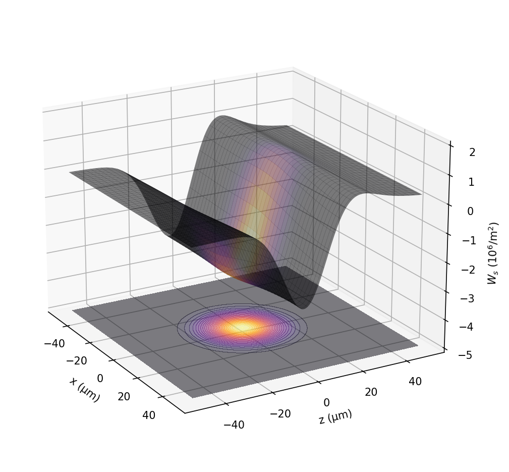
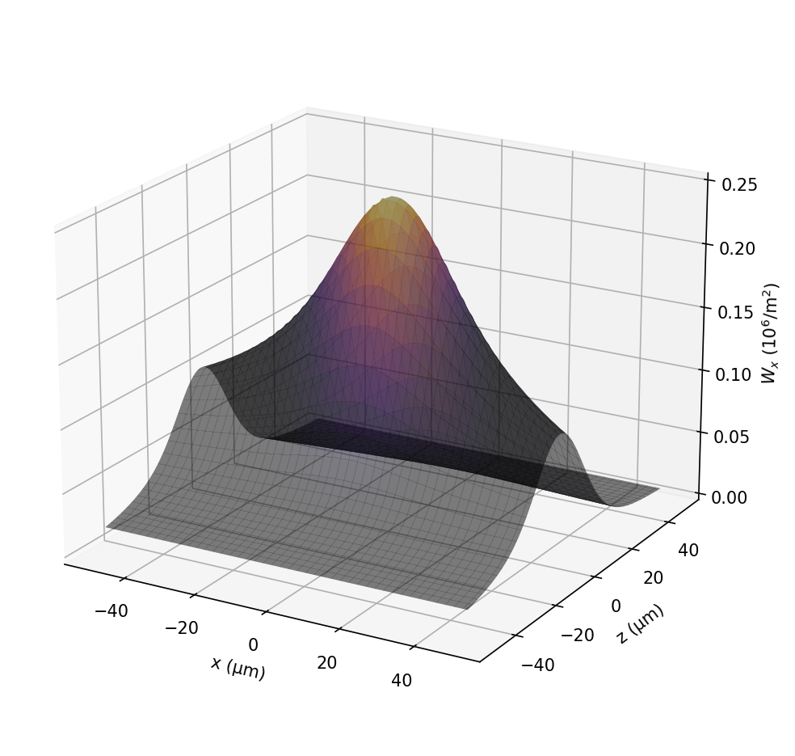
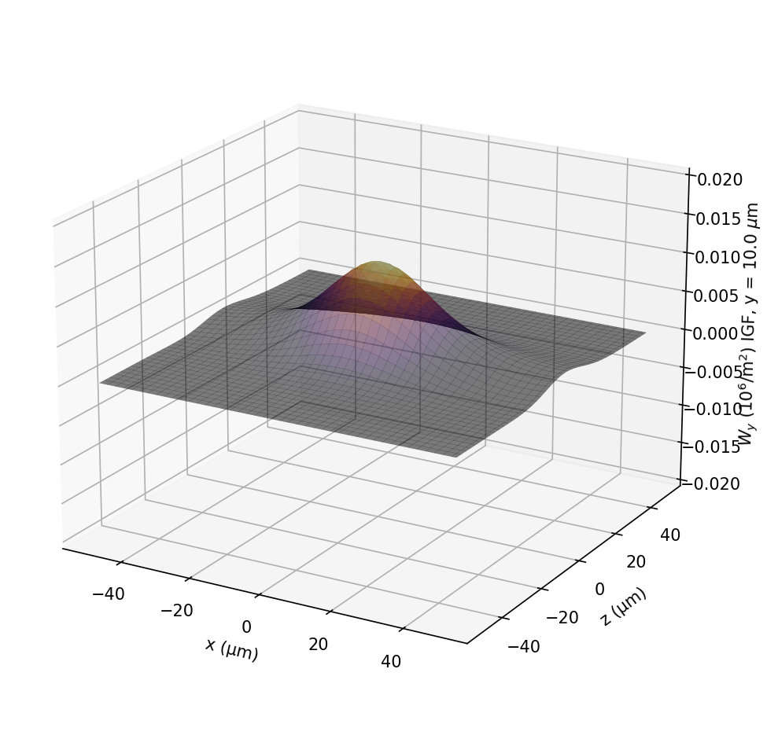

# PyCSR3D
3D Coherent Synchrotron Radiation computation based on the formalism developed in:


"Three-dimensional effects of coherent synchrotron radiation by electrons in a bunch compressor" 

Yunhai Cai and Yuantao Ding
Phys. Rev. Accel. Beams 23, 014402 – Published 9 January 2020
https://journals.aps.org/prab/abstract/10.1103/PhysRevAccelBeams.23.014402


Also see:
www.github.com/weiyuanlou/PyCSR2D








# Conda environment

```bash
conda env create -f environment.yml
conda activate csr3d
```
